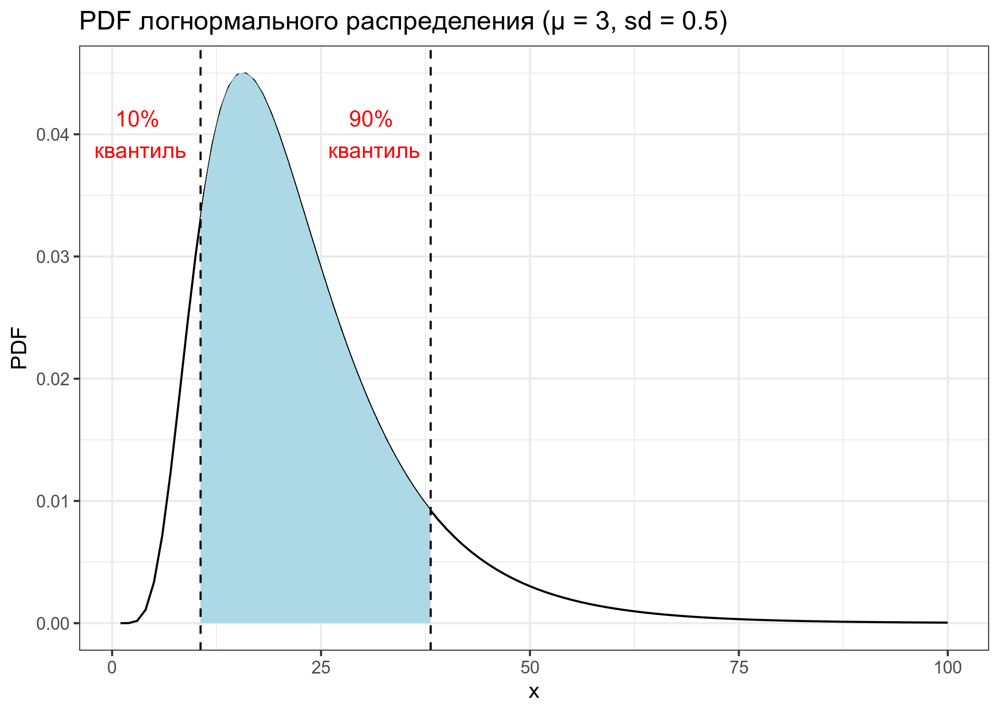
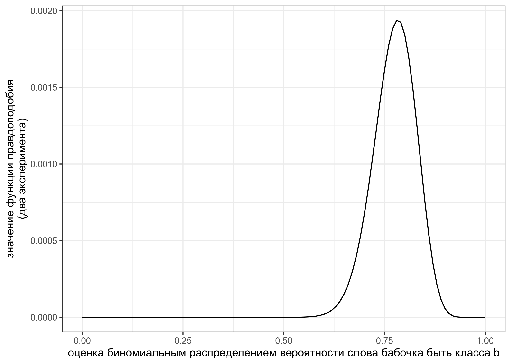
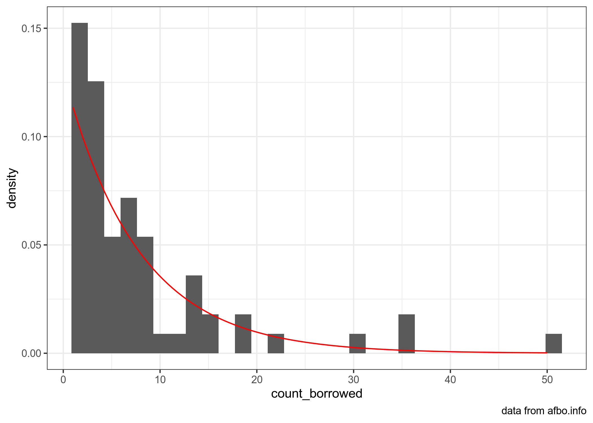

```{r, message=FALSE}
library(tidyverse)
```

Это [rmarkdown](https://rmarkdown.rstudio.com/) документ. Чтобы его скомпилировать, можно нажать в RStudio кнопку Knit. Вставьте ваше имя в заголовок, а код в соответствующие фрагменты, выделенные знаками `.

## task 1.1

Дан график логнормального распределения с лог-средним 3 и лог-стандартным отклонением 0.5. Посчитайте закрашенную площадь под кривой. В ответе выведите в консоль значение с точностью до трех знаков после запятой.



```{r}
# Ответ на задание 1.1
qlnorm(p = 0.1, meanlog = 3, sdlog = 0.5) -> q1
qlnorm(p = 0.9, meanlog = 3, sdlog = 0.5) -> q2


plnorm(q2, meanlog = 3, sdlog = 0.5) - plnorm(q1, meanlog = 3, sdlog = 0.5)
```

## task 1.2

В работе [Moroz, Verhees 2019] исследовалась вариативность классовой атрибуции в андийском языке и выяснилось, что 9 носителей относят слово *бабочка* к классу *b* и 7 носиителей относят слово к классу *r*. В новой итерации эксперимента 38 носителей отнесли слово *бабочка*  к классу *b* и 6 носителей отнесли слово к классу *r*. Визуализируйте функцию правдоподобия и посчитайте какой из вариантов, заданный функцией `seq(0, 1, by = 0.01)`, имеет наибольшее значение функции правдоподобия.



```{r}
# Ответ на задание 1.2
tibble(p = seq(0, 1, by = 0.01)) %>% 
  ggplot(aes(p)) +
  stat_function(fun = function(p) dbinom(9, 16, p)*dbinom(38, 44, p), geom = "line")+
  labs(x = "оценка биномиальным распределением вероятности слова бабочка быть класса b",
       y = "значение функции правдоподобия\n(два наблюдения)")

sapply(seq(0, 1, by = 0.01), function(p){
  dbinom(9, 16, p)*dbinom(38, 44, p)}) -> likelihood

max_likelihood <- max(likelihood)

# не уверен, требуется ли это в задаче, но я нашёл не только наибольшее значение
# но и его вероятность
tibble(seq(0, 1, 0.01),
       likelihood) %>% 
  filter(max_likelihood == likelihood) -> max_tibble

#Наибольшее значение ф-ции правдободобия: 0.001936928
print(max_tibble$likelihood)

#Вероятность: 0.78
print(max_tibble$`seq(0, 1, 0.01)`)
```

## task 1.3

[В датасете](https://afbo.info/pairs.csv?sEcho=1&iSortingCols=1&iSortCol_0=0&sSortDir_0=asc) собраны данные из базы данных [AfBo](https://afbo.info/). В этой базе данных собрана информация о том, какие языки из каких языков заимствовавали суффиксы. Скачайте данные, отфильтруйте ниболее достоверные значения (т. е. такие, чтобы в переменной `reliability` было значение `high`), воспользуйтесь методом максимального правдоподобия, чтобы оценить параметры экспоненциального распределения (смотрите справку командой `?dexp`), описывающего распределение количества заимствованных суфиксов (переменная `count_borrowing`), а потом визуализируйте данные и найденное распределение.



```{r}
library(fitdistrplus)
```

```{r}
# Ответ на задание 1.3
csv <- read_csv('https://afbo.info/pairs.csv?sEcho=1&iSortingCols=1&iSortCol_0=0&sSortDir_0=asc')

csv %>% 
  filter(reliability == 'high') -> csv_1

fitdist(csv_1$count_borrowed, distr = 'exp', method = 'mle')['estimate'] -> csv_estimate

csv_1 %>% 
  ggplot(aes(x = count_borrowed)) + 
  geom_histogram(aes(y = ..density..))+
  stat_function(fun = dexp, args = csv_estimate$estimate, colour = 'red')
```

## task 1.4

Место для рефлексии по поводу ответов. Заполняется после того, как присланы ответы на задания до 13.02.2021 23:59. Это оцениваемое задание.
