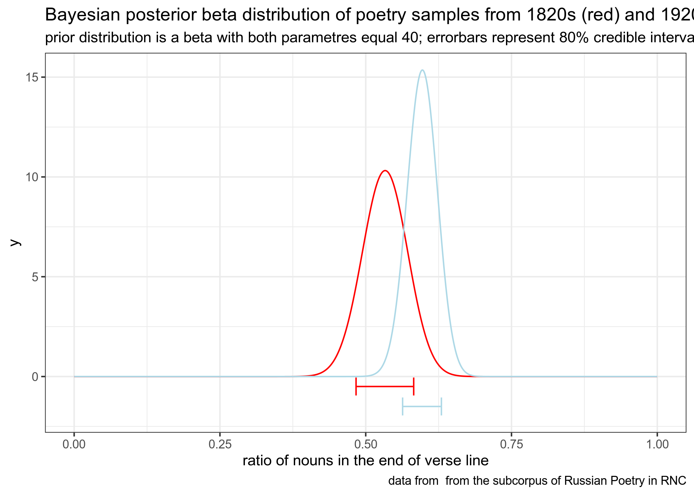

```{r, message=FALSE}
library(tidyverse)
library(dplyr)
theme_set(theme_bw())
knitr::opts_chunk$set(message = FALSE)
```

## task 2.1 (вес задания: 1)

В датасет `letter_frequency.csv` в вашем репозитории записаны частотности встречаемости букв разных языков согласно Википедии. Вы получили сообщение, содержащее одно слово: "most". Проведите байесовский апдейт, чтобы выяснить на каком языке, согласно модели, написано данное сообщение, исходя из гипотезы, что все языки равновероятны. Посчитайте апостериорную вероятность и выведите в консоль датафрейм, содержащий

* язык с максимальной апостериорной вероятностью;
* само значение апостериорной вероятности.

```{r}
# Ответ на задание 2.1
csv <- read.csv('https://raw.githubusercontent.com/Vazelisk/Rfiles/main/letter_frequency.csv')

languages = colnames(csv)[-14]
likelihood_m = c(0.02968, 0.02534, 0.03157, 0.04738, 0.02994, 0.02512, 0.03752, 0.03471, 0.02515, 0.02213, 0.03237, 0.04041, 0.03202)
likelihood_o = c(0.05796, 0.02594, 0.08683, 0.09735, 0.08779, 0.09832, 0.02976, 0.04482, 0.06667, 0.06063, 0.04636, 0.02166, 0.05614)
likelihood_s = c(0.07948, 0.07270, 0.07977, 0.06805, 0.06092, 0.04981, 0.03014, 0.06590, 0.05224, 0.05733, 0.05805, 0.05630, 0.07862)
likelihood_t = c(0.07244, 0.06154, 0.04632, 0.04336, 0.05276, 0.05623, 0.03314, 0.07691, 0.02475, 0.06923, 0.06862, 0.04953, 0.08750)

tibble(language = c(languages),
       prior = 1 / (length(csv[1, ]) - 1),
       likelihood_m = likelihood_m,
       likelihood_o = likelihood_o,
       likelihood_s = likelihood_s,
       likelihood_t = likelihood_t,
       product = prior*likelihood_m*likelihood_o*
                       likelihood_s*likelihood_t,
       posterior = product/sum(product)) -> f_df

max_value = max(f_df$posterior)
f_df %>% 
  filter(posterior == max_value) -> f_row
f_row = f_row[1]
answer = data.frame(f_row, max_value)
answer
```

## task 2.2 (вес задания: 2)

В датасете `RNC_verses.csv` в вашем репозитории содержится выборка строчек из стихотворений разных русскоязычных авторов из поэтического подкорпуса НКРЯ (по одной на каждого автора), написанных в 1820 и 1920 годах (данные собрала О. Н. Ляшевская). В переменной `pos` размечена часть речи последнего слова строки. Смоделируйте вероятность появления существительного в конце стихотворения для стихов разных веков, используя априорное бета распределение с параметрами 40 и 40, посчитайте 80% байесовский доверительный интервал и визуализируйте все это на графике (обратите внимание на подписи).



```{r}
# Ответ на задание 2.2

csv <- read_csv('https://raw.githubusercontent.com/Vazelisk/Rfiles/main/RNC_verses.csv')

csv %>% 
  filter(decade == '1820s',
         pos == 'NOUN') -> nouns_in_1820

csv %>% 
  filter(decade == '1820s') -> poss_in_1820

poss_in_1820 = nrow(poss_in_1820)
nouns_in_1820 = nrow(nouns_in_1820)

csv %>% 
  filter(decade == '1920s',
         pos == 'NOUN') -> nouns_in_1920

csv %>% 
  filter(decade == '1920s') -> poss_in_1920

poss_in_1920 = nrow(poss_in_1920)
nouns_in_1920 = nrow(nouns_in_1920)

cred_int_l_1820 <- qbeta(p = 0.1, shape1 = nouns_in_1820+40, shape2 = (poss_in_1820-nouns_in_1820)+40)
cred_int_h_1820 <- qbeta(p = 0.9, shape1 = nouns_in_1820+40, shape2 = (poss_in_1820-nouns_in_1820)+40)

cred_int_l_1920 <- qbeta(p = 0.1, shape1 = nouns_in_1920+40, shape2 = (poss_in_1920-nouns_in_1920)+40)
cred_int_h_1920 <- qbeta(p = 0.9, shape1 = nouns_in_1920+40, shape2 = (poss_in_1920-nouns_in_1920)+40)


tibble(x = seq(0, 1, by = 0.001),
       y = dbeta(x, shape1 = nouns_in_1820+40,
                 shape2 = (poss_in_1820-nouns_in_1820)+40),
       z =  dbeta(x, shape1 = nouns_in_1920+40,
                 shape2 = (poss_in_1920-nouns_in_1920)+40)) %>% 
  ggplot(aes(x, y, z))+
  geom_line(aes(x, y), color = 'red')+
  geom_line(aes(x, z), color = 'lightblue')+
  annotate(geom = "errorbar", y = -0.5, xmin = cred_int_l_1820, xmax = cred_int_h_1820, color = 'red')+
  annotate(geom = "errorbar", y = -1.5, xmin = cred_int_l_1920, xmax = cred_int_h_1920, color = 'lightblue')+
  labs(title = "Bayesian posterior beta distribution of poety samples from 1820s (red) and 1920 (lightblue)",
       subtitle = "prior distribution is a beta parametres equal 40; errorbar represent 80% credible interval",
       x = "ratio of nouns in the end of verse line",
       caption = "data from the subcorpus of Russion Poetry in RNC")
```

## task 2.3 (вес задания: 2)

В датасет `eurasianphonology.csv` в вашем репозитории записаны агрегированные данные из базы данных фонологических систем Евразии <http://eurasianphonology.info> (Nikolaev et al. 2015). Смоделируйте распределение доли гласных из всех сегментов нормальным распределением с априорным нормальным распределением со средним = 0.301 и стандартным отклонением = 0.118, посчитайте 80% байесовский доверительный интервал и визуализируйте все это на графике (обратите внимание на подписи).


ratio = list()
x = 1
for (var in 0:(nrow(csv)/2-1)){
  print(csv[2:3][x:(x+1), ])
  vowels_freq = (csv[3][(x+1), ])/((csv[3][(x), ])+(csv[3][(x+1), ]))
  x = x + 2
  ratio = append(ratio, vowels_freq)}

csv %>% 
  filter(segment_type == "vowel") -> csv1

csv1["ratio"] = unlist(ratio)


```{r}
# Ответ на задание 2.3
library(ggplot2)
csv <- read_csv("https://raw.githubusercontent.com/Vazelisk/Rfiles/main/eurasianphonology.csv")

csv1 <- csv[order(csv$language),]

ratio = list()
n = 0
for (row in 1:(nrow(csv1)/2)){
  row = row + n
  freq = csv1$n[row+1] / (csv1$n[row] + csv1$n[row+1]) 
  
  #кол-во гласных разделить на кол-во согласных. Пользуюсь тем, что у меня   в парах языков всегда идет сначала согласные, а потом гласные
  ratio = append(ratio, freq)
  n = n + 1
}

csv1 %>% 
  filter(segment_type == "vowel") -> csv2

csv2["ratio"] = unlist(ratio)

sd_prior <- 0.118 
sd_data <- sd(csv2$ratio)
sd_post <- 1/sqrt(1/sd_prior^2 + 1/sd_data^2)
mean_prior <- 0.301
mean_data <- mean(csv2$ratio)
mean_post <- weighted.mean(c(mean_prior, mean_data), c(1/sd_prior^2, 1/sd_data^2))

cred_int_l <- qnorm(p = 0.1, mean = mean_post, sd = sd_post)
cred_int_h <- qnorm(p = 0.9, mean = mean_post, sd = sd_post)

csv2 %>%
  ggplot(aes(ratio)) +
  geom_histogram(aes(y = ..density..), fill = "gray70")+
  stat_function(fun = dnorm, args = list(mean_prior,  sd_prior), color = "lightblue")+
  stat_function(fun = dnorm, args = list(mean_post,  sd_post), color = "red", size = 1)+
  annotate(geom = "errorbar", y = 0, size = 2.5, xmin = cred_int_l, xmax = cred_int_h, color = 'black')+
  annotate("text", x= 0.315, y=-0.4, size = 5, label = "80% credible interval")+
  labs(title = "Bayesian prior N(0.301, 0.118) (blue) and posterior (red)",
       x = "vowel ratio",
       caption = "data from http://eurasianphonology.info (Nikolaev et al. 2015")

```

## task 2.4 (вес задания: 1)

Приведите ниже аргумент(ы) за/против модели в задании 2.3.<br>
Против:<br>
1. Кмк довольно неточный доверительный интервал покрывает только половину выборки. <p>
2. Prior не очень хорошо учитывает неравномерность данных, особенно пустоту в начале.<p>
3. Пик данных и пики у распределений расходятся.<p>
4. Posterior вообще плох и не похож на данные.<br>
За:<br>
1. Общая картина в принципе понятна, хоть она и не очень корректна.
...

## task 2.5 (вес задания: 1)

Место для рефлексии по поводу ответов. Заполняется после того, как присланы ответы на задания до 08.03.2021 23:59. Это оцениваемое задание.


В первом задании я конечно сделал ручками некоторую часть обработки датасета, можно было бы более автоматизировано (теперь я знаю как!).
Во втором задании опять можно было бы сделать проще.
Ну и в третьем тоже, но оно лучше всего выглядит) 
В 2.4 я скорее описывал модель по графику и искал несоответствия распределений, а в ответах скорее про более глобальные проблемы.