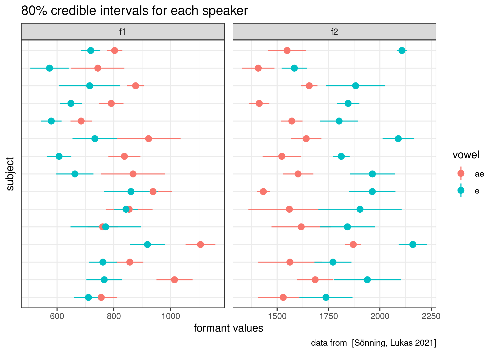
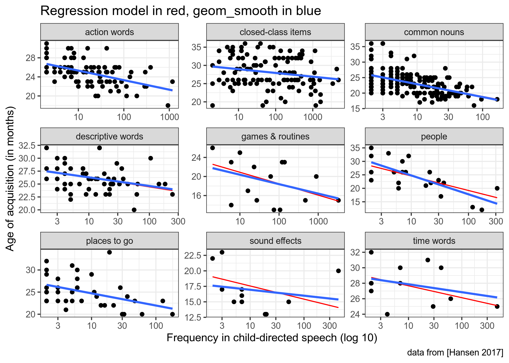
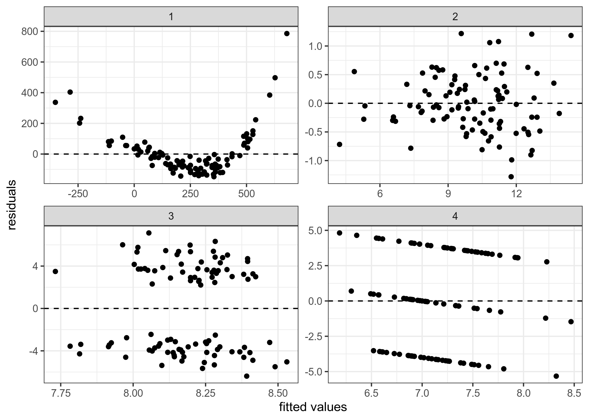

```{r, message=FALSE}
library(tidyverse)
theme_set(theme_bw())
knitr::opts_chunk$set(message = FALSE)
library(fitdistrplus)
library(lme4)
library(lmerTest)
```

## task 3.1 (вес задания: 3)

В датасет `vowel_data.csv` записаны значения формант гласных для носителей британского английского языка из исследования [Sönning, Lukas 2021]. Используя данные всех носителей, проведите эмпирическую байесовскую оценку, чтобы получить априорное распределение, сделайте байесовский апдейт всех носителей и постройте график 80% доверительных интервалов для каждого носителя. Какой носитель, согласно полученным доверительным интервалам, показывает самую невыразительную разницу между гласными?

```{r}
library(dplyr)
br_vowels <- read_csv("vowel_data.csv")

subset(br_vowels, select = c("subject", "F1", "vowel")) %>% 
  filter(vowel == 'e') %>% 
  subset(select = c("subject", "F1")) -> e_f1

subset(br_vowels, select = c("subject", "F2", "vowel")) %>% 
  filter(vowel == 'e') %>% 
  subset(select = c("subject", "F2")) -> e_f2

subset(br_vowels, select = c("subject", "F1", "vowel")) %>% 
  filter(vowel == 'ae') %>% 
  subset(select = c("subject", "F1")) -> ae_f1

subset(br_vowels, select = c("subject", "F2", "vowel")) %>% 
  filter(vowel == 'ae') %>% 
  subset(select = c("subject", "F2")) -> ae_f2


e_f1 <- fitdist(e_f1$F1, distr = 'norm', method = 'mle')
e_f2 <- fitdist(e_f2$F2, distr = 'norm', method = 'mle')
ae_f1 <- fitdist(ae_f1$F1, distr = 'norm', method = 'mle')
ae_f2 <- fitdist(ae_f2$F2, distr = 'norm', method = 'mle')

e_f1$estimate %>% 
  bind_rows(e_f2$estimate,
            ae_f1$estimate,
            ae_f2$estimate) %>% 
  mutate(formant = c("f1", "f2", "f1", "f2"),
         vowel = c("e", "e", "ae", "ae")) %>% 
  rename(mean_prior = mean,
         sd_prior = sd) ->
  priors

br_vowels %>% 
  group_by(subject, vowel) %>% 
  summarise(mean_f1 = mean(F1),
            mean_f2 = mean(F2),
            sd_f1 = sd(F1),
            sd_f2 = sd(F2)) %>% 
  pivot_longer(names_to = "type", values_to = "values", mean_f1:sd_f2) %>% 
  separate(type, into = c("type", "formant")) %>% 
  pivot_wider(values_from = values, names_from = "type") %>% 
  left_join(priors) %>% 
  rowwise() %>% 
  mutate(sd_post = 1/sqrt(1/sd_prior^2 + 1/sd^2),
         mean_post = weighted.mean(c(mean_prior, mean), c(1/sd_prior^2, 1/sd^2)),
         cred_int_l_80 = qnorm(0.1, mean_post, sd_post),
         cred_int_h_80 = qnorm(0.9, mean_post, sd_post),
         cred_int_mean = mean(c(cred_int_l_80, cred_int_h_80))) %>%
  ggplot(aes(y = subject, 
             x = cred_int_mean,
             xmin = cred_int_l_80, 
             xmax = cred_int_h_80, 
             color = vowel))+
  geom_pointrange()+
  facet_wrap(~formant, scales = "free")+
  labs(title = '80% credible intervals for each speaker',
       x = 'formant values',
       y = 'speaker',
       caption = 'data from [Sönning, Lukas 2021]')


# Дорогая Аня, тут будет страшно. но я попробую пояснить логику. Считал так (по носителю):
# Разницы между мин и макс значением формант 1 + разницы между мин и макс значением формант 2 = разница между гласными у носителя
# Или иначе говоря: разница между cred_int_l между двумя гласными в форманте 1 + разница между cred_int_h между двумя гласными в форманте 1
# И то же самое для форманты 2
# и все суммируется и ищется минимальная сумма разниц


br_vowels %>% 
  group_by(subject, vowel) %>% 
  summarise(mean_f1 = mean(F1),
            mean_f2 = mean(F2),
            sd_f1 = sd(F1),
            sd_f2 = sd(F2)) %>% 
  pivot_longer(names_to = "type", values_to = "values", mean_f1:sd_f2) %>% 
  separate(type, into = c("type", "formant")) %>% 
  pivot_wider(values_from = values, names_from = "type") %>% 
  left_join(priors) %>% 
  rowwise() %>% 
  mutate(sd_post = 1/sqrt(1/sd_prior^2 + 1/sd^2),
         mean_post = weighted.mean(c(mean_prior, mean), c(1/sd_prior^2, 1/sd^2)),
         cred_int_l_80 = qnorm(0.1, mean_post, sd_post),
         cred_int_h_80 = qnorm(0.9, mean_post, sd_post),
         cred_int_mean = mean(c(cred_int_l_80, cred_int_h_80))) -> final_df

final_df %>% 
  group_by(formant, cred_int_mean) %>% 
  filter(formant == 'f1') -> f1

difference_f1 = list()
n = 0
for (row in 1:(nrow(f1))){
  row = row + n
  next_row = row + 1
  dif_h = f1$cred_int_h_80[row] - f1$cred_int_h_80[next_row]
  dif_l = f1$cred_int_l_80[row] - f1$cred_int_l_80[next_row]
  dif = dif_h + dif_l
  dif = abs(dif)
  difference_f1 = append(difference_f1, dif)
  n = n + 1
  }
  
final_df %>% 
  group_by(formant, cred_int_mean) %>% 
  filter(formant == 'f2') -> f2

difference_f2 = list()
n = 0
for (row in 1:(nrow(f2))){
  row = row + n
  next_row = row + 1
  dif_h = f2$cred_int_h_80[row] - f2$cred_int_h_80[next_row]
  dif_l = f2$cred_int_l_80[row] - f2$cred_int_l_80[next_row]
  dif = dif_h + dif_l
  dif = abs(dif)
  difference_f2 = append(difference_f2, dif)
  n = n + 1
  }


final_list = list()
for (row in 1:15){
  total_dif = as.double(difference_f1[row]) + as.double(difference_f2[row])
  final_list = append(final_list, total_dif)
}
  
min(unlist(final_list)) # надо посмотреть в final_list номер человека с таким значением
# это человек под номером 5, то есть NS05 (надо ориентироваться по final_df)
```

   

Ответ: NS05

## task 3.2 (вес задания: 3)

В датасет `norwegian_lexical_development.csv` записаны данные из исследования [Hansen 2017], посвященного усваиванию лексики носителями норвежского. В датасете собраны следующие переменные:

* `Word_NW` -- норвежские слова;
* `Translation` -- перевод норвежских слов на английский;
* `CDS_freq` -- усредненная частота слова в речи, адресованной детям;
* `AoA` -- усредненный возраст освоения слова (в месяцах);
* `Lex_cat` -- лексическая категория, приписанная исследователями.

Постройте и визуализируйте лучшую регрессию, которая предсказывает возраст усвоения слова в зависимости от частотности в речи, адресованной детям. Помните про необходимость преобразования переменных, чтобы связь была линейной. Сравните полученный результат с результатом работы функции `geom_smooth()`, которая генерирует отдельную независимую регрессию для каждой из групп.

```{r}
nld <- read_csv("norwegian_lexical_development.csv")

m1 <- lmer(formula = AoA~log10(CDS_freq)+(1|Lex_cat), data = nld)
m2 <- lmer(formula = AoA~log10(CDS_freq)+(1+log10(CDS_freq)|Lex_cat), data = nld)
m3 <- lmer(formula = AoA~log10(CDS_freq)+(0+log10(CDS_freq)|Lex_cat), data = nld)

anova(m1, m2, m3)

nld %>%
  mutate(predicted = predict(m2)) %>% 
  ggplot(aes(CDS_freq, AoA))+
  geom_point()+
  facet_wrap(~Lex_cat, scale = "free")+
  geom_line(aes(y = predicted), color = 'red')+
  geom_smooth(method = "lm", se = FALSE)+
  scale_x_log10()+
  labs(x = "Frequency in child-directed speech (log 10)", 
  y = "Age of acquisition (in months)",
  caption = "data from [Hansen 2017]")
```



## task 3.3 (вес задания: 2)

Перед вами четыре графика остатков. Проанализируйте каждый из них и опишите нарушения ограничений на применение регрессии, которые вы можете увидеть.



### График 1
Ненормальное распределение остатков. Нелинейная связь, поэтому регрессия неинформативна. Остатки распределены ненормально.

### График 2
С левой стороны графика довольно мало значений, что означает гетероскидастичность.А так вроде все довольно хорошо.

### График 3
Нет значений, близких к самой линии регрессии. Это значит, что регрессия как-то не очень точно предсказывает данные.
Остатки сгруппированы близко к центру, по краям их количество сильно меньше. Значит данные гетероскидастичны. Есть какое-то подобие паттернов, как будто две отдельные группы.Возможно, данные мультиколлинеарны, раз они так делятся на 2 группы.

### График 4
Нелинейная связь, остатки выстроенны в прямые. Также остатки почти не представлены с правой стороны графика, то есть они гетероскидастичны.Возможно, данные мультиколлинеарны, раз они так выстроились.

## task 3.4 (вес задания: 1)

Место для рефлексии по поводу ответов. Заполняется после того, как присланы ответы на задания до 28.03.2021 23:59. Это оцениваемое задание.

1. Можно было бы использовать функцию фильтер прямо в созаднии переменных.
Я зачем-то добавил название оси y, не снижайте...
Я считаю, что за мой способ нахождения человечка нужно сразу ставить 10!

2. Тут все хорошо.

3.2. Я выделил гетероскидастичность на основании того, что слева мало данных и они непохожи, но в принципе это следствие непостоянной дисперсии.